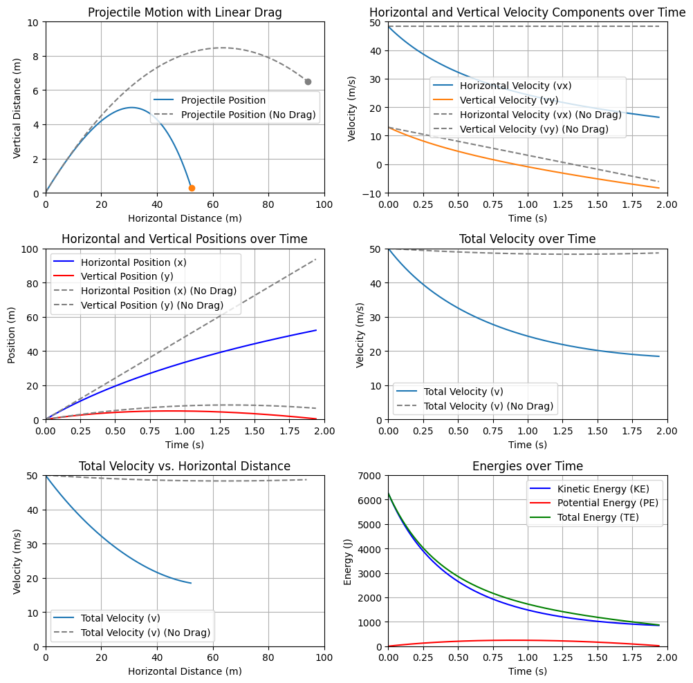

# Projectile Motion with Drag

## Overview

This project explores the physics of projectile motion with drag. It involves solving differential equations to model the motion of a projectile under the influence of gravity and air resistance. The analysis and simulations are done using standard Python libraries along with Matplotlib for visualization.

## Contents

The notebook includes the following sections:

### Introduction

Provides an overview of the project, the physical principles behind projectile motion, and the effects of air resistance.

### Mathematical Model

Details the mathematical formulation of the problem, including the differential equations that describe the motion of a projectile with drag.

### Numerical Solution

Describes the numerical methods used to solve the differential equations using Python's standard library. Methods such as Euler's method or Runge-Kutta methods are implemented manually without the use of specialized scientific libraries.

### Simulation and Results

Presents the results of the simulations, including plots and graphs that illustrate the trajectory of the projectile under different conditions. Discusses the impact of varying parameters like initial velocity, angle of launch, and drag coefficient.

### Conclusion

Summarizes the findings and discusses potential extensions of the project, such as considering different shapes of projectiles or varying atmospheric conditions.

### References

Lists any academic papers, textbooks, or online resources used in the preparation of the project.

## How to Run

1. Ensure you have Python installed, along with Matplotlib.
2. Clone this repository to your local machine.
3. Open the Jupyter notebook `Projectile_Motion_with_Drag.ipynb`.
4. Run the cells sequentially to reproduce the results.

## Requirements

- Python 3.x
- Jupyter Notebook
- Matplotlib

## Example Plots

## Author

[Berkay Yılmaz](https://github.com/berkayyilmaz)
[Ahmet ali Akkurt](https://github.com/Ahmetaliakkurt)
Livanur Çelik
